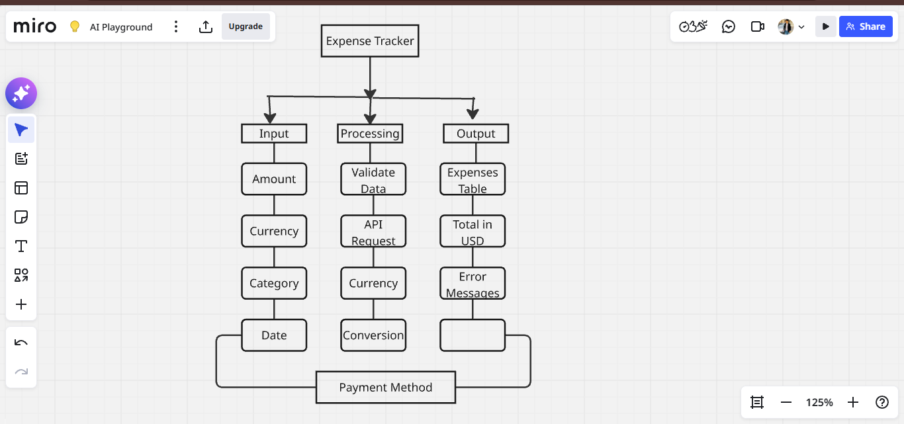

# ExpenseTracker

A simple desktop expense tracker that helps you log and manage your daily spending across multiple currencies.

## Features

- 📊 Track expenses in multiple currencies (USD, EUR, EGP)
- 💳 Payment method tracking (Cash, Credit Card, Paypal)
- 🏷️ Categories with the ability to add your own on the fly
- 📅 Date-based expense logging
- 📋 Expense history table with a scrollable view
- 🗑️ Delete a selected expense
- 💰 Live per-currency balance summary cards (USD / EUR / EGP)
- 📱 Clean dark-theme UI built with Tkinter
- 💾 All data stored locally on your device — no internet or account required

## Tech Stack

- **Language:** Python 3
- **Framework:** Tkinter (Python standard library)
- **Storage:** Local JSON file (`expenses.json`) — no external database or server

## Getting Started

### Prerequisites

- Python 3.7+ installed on your machine
- Tkinter (included with Python on Windows; on Linux install via your package manager, e.g. `sudo apt install python3-tk`)

### Installation

```bash
# Clone the repository
git clone https://github.com/ebrahemsaeed911-lang/ExpenseTracker.git

# Navigate into the project folder
cd ExpenseTracker

# No extra packages required — Tkinter ships with Python
```

### Running the App

```bash
python expense-tracker.py
```

## Usage

1. Enter the expense amount
2. Select the currency (USD / EUR / EGP)
3. Choose or type what the expense was for (category)
4. Pick the date and payment method
5. Click **+ Add Expense** to log it
6. Select a row and click **Delete Selected** to remove an expense
7. Check the live USD / EUR / EGP summary cards at a glance

## Screenshot



## Roadmap

- [ ] Export expenses to CSV/Excel
- [ ] Monthly/weekly spending charts
- [ ] Currency conversion with live exchange rates
- [ ] Category-based filtering
- [ ] Bulk delete of multiple selected expenses

## License

This project is licensed under the MIT License.

## Contact

Feel free to open an issue or reach out if you have suggestions!